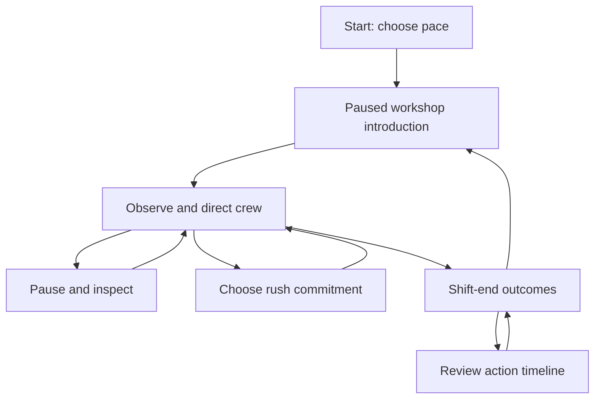

# One More Shift — scope, scenario and interaction map v0.2

Date: September 30, 2026. Status: design baseline, now implemented in [playable prototype v0.3](implementation-v0.3.md). Current tuning differences and verification are documented there.

This is the current lead-game design. It supersedes the One More Shift scenario, scoring and control assumptions in the portfolio's v0.1 package. The portfolio philosophy and rankings remain the baseline; they have not been revalidated. Numerical rules here are provisional. One-minute worksheet arithmetic demonstrates feasible plans under these assumptions, not entertainment, optimality or final real-time balance.

## Decision summary

Build one short, pausable strategy encounter: **Festival Finish**. Eighteen crew work across Gather, Assemble and Dispatch with 45 shift minutes remaining. A failed machine forces a recovery choice; a rush offer arrives before recovery is complete. Players then rebalance to the new constraint and finish the commitments they chose.

The fantasy is “My crew and I can still pull this off.” The board should make clever recoveries feel satisfying. Players direct groups; routine production is automatic. End feedback reports outcomes rather than collapsing them into a productivity grade.

**Current scope:** one workshop, seven actions, four pressure systems, one fixed event timeline, a six-minute normal-speed run, results and instant rematch. Human workers with expressive silhouettes; playful miniature workshop; no employee-management forms. Desktop landscape first, responsive layout where practical; mobile completeness is not a first-build requirement.

## What changed after the decision walkthrough

| Earlier assumption | v0.2 decision | Reason |
|---|---|---|
| Six interchangeable technicians | Two technicians, both initially at Assemble | Makes expertise scarce without introducing many character stats |
| Repair and bypass can run together | Repair needs both technicians; bypass needs at least one technician | Prevents an effortless combined response; ordinary crew cannot run the bypass unsupervised |
| Repair can begin immediately after failure | Crew travel takes one shift minute, including to the repair bay | Makes preparation and response time visible |
| Rush announced after recovery may finish | Offer at minute 10, arrival at minute 12 | Commitment happens during the recovery problem |
| 36 base items; 10-item rush | 48 base items; choose 0, 6 or 12 rush items | Gives allocation and recovery enough work to matter |
| All final orders due at shift end | Rush due minute 42; final base order due minute 45 | Makes dispatch priority consequential |
| Optional combined numeric score | No combined score in first prototype | Outcome dimensions remain understandable and independently meaningful |
| Free reserve-management concept | Idle/reserve is simply a crew assignment choice | No additional resource or screen |
| Mixed screen-layout possibilities | Fixed top-down workshop | Reduces implementation and readability risk |

These changes are design decisions for this test, not claims about how real workshops should operate.

## Product experience and non-negotiables

Players should notice a stalled flow, make a choice, see work move again, and want to test another approach. Three target moments: relief when a jam clears, tension when one promise competes with another, and discovery when the constraint moves.

Every decision exposes its direct costs: capacity lost at the origin, travel delay, required expertise, deadline or energy. No arbitrary chaos meter, hidden worker penalties, unsafe productivity boost, score penalty for pause, paid recovery or grind. Crew below the visible energy threshold rest automatically. Humor comes from the gadgets and situation, not exhausted people.

## Seven player actions

| Action | Player question | Board response |
|---|---|---|
| Reassign selected crew | Where will another pair of hands matter? | Crew travel, origin capacity falls, destination wakes up |
| Assign repair crew | Is future capacity worth the current interruption? | Technician travel and explicit repair progress |
| Assign manual assembly | Is immediate output worth the energy cost and repair delay? | Slower hand-operated lane visibly runs |
| Send crew to rest | Can I spare them, or is their work already complete? | Crew enter break area and regain energy |
| Choose dispatch priority | Which promise should receive the next finished item? | Priority badge moves; departures fill that order |
| Choose rush quantity | What can this plan absorb? | Accepted quantity/deadline appears; arrival adds work |
| Pause/inspect | What changed, and what should I do next? | All time stops; selection and planning remain available |

Manual assembly is an explicit destination next to the broken machine. For the paper worksheet, its four workers are counted within Assemble; real controls must make that assignment explicit. Returning to powered assembly is automatic when repaired, with a notice; no surprise second click. No keyboard action should secretly move technicians from repair to ordinary work.

## Scenario and timing

All event times below are **elapsed shift minutes**, not countdown values. Normal speed uses eight real seconds per shift minute: 45 minutes = six active real minutes. Slower pace uses sixteen seconds per shift minute. Pause freezes events, production, travel and fatigue. The interface says “45 shift minutes • about 6 minutes of play” before starting.

| Elapsed minute | Event | Information/action |
|---:|---|---|
| 0 | Start, initially paused | Eighteen crew, six per area; two visible technicians at Assemble |
| 6 | Machine warning | “Assembly drive is rattling. Keep your technicians ready.” State that failure is expected at minute 8 in this baseline |
| 8 | Machine stops | Powered assembly halts; repair and manual alternatives highlighted |
| 10 | Rush offer appears | Choose none, 6 or 12; due minute 42; decision closes at minute 12 |
| 12 | Accepted rush arrives | New raw items enter Gather; unresolved offer defaults to none |
| 14 | First base deadline | 16 gadgets due |
| 30 | Second base deadline | Another 16 gadgets due |
| 42 | Rush deadline | Accepted rush quantity due |
| 45 | Final base deadline and shift end | Last 16 base gadgets due; resolve terminal result |

Rush offer auto-pauses once so a new player can read it. They can choose immediately or resume to inspect actual progress and decide before minute 12. Clearly label the unselected default and remaining decision time. Once chosen, the quantity is committed; pre-confirmation options are freely editable, no post-confirmation undo of elapsed consequences. Players can rematch to test a different commitment.

## Work, crew and resources

Initial item inventory: **30 raw items at Gather, 12 ready at Assemble, 6 finished at Dispatch**, zero delivered. These are 48 physical items at different stages, not 48 items per area. Accepted rush adds 0/6/12 raw items at minute 12. All gadgets are interchangeable in this prototype; a dispatched item is assigned to an order at departure. No delivery before the rush exists.

All 18 workers can do ordinary work. Only crew 7 and 8 (IDs 6 and 7 in the worksheet) are technicians. They begin at Assemble. Everyone starts at 75 energy out of 100. Technician status changes qualification, not ordinary productivity. Names and reactions are cosmetic; no hidden personality traits.

| Area/task | Capacity and rate | Energy use per productive shift minute |
|---|---|---:|
| Gather | Up to 8 workers × 0.25 items/minute each | 1 |
| Powered Assemble | Up to 8 workers × 0.20 items/minute each | 1 |
| Dispatch | Up to 6 workers × 0.30 items/minute each | 1 |
| Manual assembly | Up to 4 workers × 0.10 items/minute each, at least one technician present | 2 |
| Repair | Exactly two technicians, four productive minutes | 1 |
| Rest | Restore 4 energy/minute, capped at 100 | — |
| Travel/idle | One minute to any destination; no output or energy recovery | 0 |

Energy >=40: full individual rate. Energy from 20 to below 40: 75% individual rate. Below 20: automatic move to Rest using the usual travel delay; remain there until at least 40. Do not apply reduced-rate factor to the whole crew merely because one member is tired. Repair is four qualified work minutes; progress persists if interrupted but advances only with both technicians present. Extra ordinary workers do not accelerate repair. One technician can supervise manual work; the second may help manually but cannot repair alone.

When area staffing exceeds working slots, surplus crew visibly wait and do not consume productive-work energy. Stable ordering of active slots avoids hidden capacity changes. Automatic rest occurs between work steps; a worker cannot produce while traveling or resting. Manual mode and powered mode cannot both process the same item. Buffers are unbounded in the prototype; excess work in process costs time and opportunity, not invented overflow punishment.

## Four pressure systems and their connections

| System | Dependency | What reveals it |
|---|---|---|
| Linked production | Gather supplies Assemble; Assemble supplies Dispatch | Visible item lanes and waiting queues |
| Transfer time | More capacity at destination costs a temporary interruption | Moving crew tokens and arrival indication |
| Equipment recovery | Repair expertise competes with immediate manual output | Technician badges, disabled-condition explanations, repair bar |
| Crew energy | High effort now may reduce later capacity | Energy icons and explicit slowdown threshold |

Deadlines create a reason to act within those systems. At first Assemble constrains the flow; after repair, a reduced Dispatch team can become the constraint. Resting a crew whose work is complete creates recovery without losing deliveries. No artificial event is needed to force that second decision.

## Numerical comparison: what the worksheet supports

See [balance worksheet](balance-v0.2.md) for exact assignment schedules and arithmetic rules; [minute ledger](paper-ledger-v0.2.csv) contains all checkpoints. The worksheet processes whole items in one-minute batches. The eventual continuous presentation may cross deadlines differently and must be rechecked before claiming the same results.

| Plan | Rush accepted | First base by 14 | Second base by 30 | Rush by 42 | Final base by 45 | Total by 45 | Mean final energy |
|---|---:|---:|---:|---:|---:|---:|---:|
| Early repair + downstream rebalance | 12 | 16/16 | 16/16 | 12/12 | 16/16 | 60/60 | 38.3 |
| Same plan + rest after area completion | 12 | 16/16 | 16/16 | 12/12 | 16/16 | 60/60 | 51.7 |
| Bypass three minutes, then repair | 6 | 16/16 | 16/16 | 6/6 | 16/16 | 54/54 | 41.4 |
| Same bypass plan, full rush | 12 | 16/16 | 16/16 | 12/12 | 13/16 | 57/60 | 37.7 |
| No staffing or recovery action; full rush | 12 | 15/16 | 0/16 | 0/12 | 0/16 | 15/60 | 60.0 |

At minute 14, bypass has delivered 17 items while early repair has delivered 16; at minute 30 early repair has delivered 36 and bypass 33. Thus the model supports an immediate-versus-later tradeoff, but **early repair is the stronger known plan for this exact baseline**. The bypass benefit is small; do not claim equal strategic strength. Prepositioning both technicians during the warning completes repair one minute earlier but sacrifices earlier production; this sampled plan still delivers 60 and ends at mean energy 37.8, so it is not automatically superior.

Rest after completed work dominates unnecessary idling on crew condition without increasing deliveries. That is intended: recognizing available slack should help. Still, an early-rest versus production tradeoff has not been fully quantified; do not advertise deep fatigue tactics yet.

The full-rush bypass result is an example, not proof that every bypass strategy must fail. Sampled policies are not an exhaustive optimum search. Finishing all base orders plus half the rush is a complete successful plan, not a lesser moral outcome.

## Dominant-tactic review and design response

1. **Repair + bypass:** blocked by technician qualification, not by an arbitrary exclusive-mode button. Both options explain their staffing requirements. Splitting the two technicians leaves repair stalled; manual output may continue with one. That is permitted, but not free simultaneous repair.
2. **Always accept everything:** the tested early plan can take all; the tested bypass plan cannot fulfill all by close. Accepting full rush remains a deliberate commitment, not a universally safe policy. No hidden demand scaling.
3. **Always staff the largest queue:** queue size does not equal system constraint. More Gather work can build inventory while Dispatch is short. The board must show both upstream stock and downstream departures.
4. **Leave repaired staffing forever:** loses delivery capacity after upstream completion. Rebalancing back to Dispatch is necessary in the sampled full-rush plan.
5. **Always ship original orders first:** rush has the earlier final deadline. For the early plan, putting the final base order ahead of rush leaves only 7/12 rush items on time; putting rush ahead delivers all 12 on time while still finishing the base order by 45.
6. **Always rest everyone:** high crew energy with missed promises is visible, without a score formula claiming one dimension is morally correct.
7. **Pause for unlimited planning:** intentionally allowed. The game rewards choices, not motor speed. Its fantasy must survive pausing.

## Screen and interaction map

| Surface | Contents | Exit/action |
|---|---|---|
| Start card | Premise, expected length, Start, slower pace, sound/reduced-motion settings | Start opens paused board |
| Paused board introduction | Three tiny instruction steps: select crew; choose destination; watch flow | Player dismisses and resumes; guidance remains available |
| Workshop board | Fixed top-down Gather, Assemble, Dispatch; repair/manual areas near Assemble; Break area; visible lanes and 18 crew | Main play, pause and inspect |
| Rush card | Quantity choices, due time, confirm; defaults clearly stated | Return to same anchored board |
| Shift results | Commitments by order, late/unfinished work, crew energy, action timeline | Rematch, Slower Pace, Review |

Time/pause stays at top left; deadline cards stay across the upper edge in chronological order; the workshop occupies the center; selected-group actions appear along the lower edge. Locations never jump when a notice arrives. Rush offers overlay spare space or pause the board; they do not replace it with a management form.

Order cards show actual fulfilled count and deadline, not opaque success probability. Selection preview shows known staffing/capacity change and travel time, not a fabricated guaranteed outcome forecast. “Next departure priority” is a single explicit selection. Default is earliest unfulfilled deadline; manual priority changes override it until the selected order completes, then return to earliest due. Completed orders cannot keep receiving items. Late orders remain deliverable, but automatic priority favors unfinished on-time promises over overdue work; players may override.

### Player-flow map

### Group-first controls

Ordinary reassignments: select an area → select 1, 2 or all ordinary crew → choose destination. Select technicians separately with a badge control; never silently take a technician from repair. Individual tokens remain selectable with Shift-click/add-to-selection, but managing 18 workers individually is not the primary interaction.

Keyboard: focus moves through areas, crew/group selectors, destinations and order cards; Enter confirms; Escape clears selection/closes an inspection; Space pauses outside input controls. Touch targets are generous. No drag-only actions. Commands while paused commit assignments, but travel begins when time resumes. No reassignment undo after resume; correcting a plan is another visible move. Show an explicit confirmation for withdrawing a technician from repair.

Action rejection gives the reason: “Repair needs both technicians,” “That order is already complete,” or “Crew are still traveling.” A red icon never carries the explanation alone. Sound and color are supplementary. Reduced motion retains clear state changes.

## Feedback and replay

No combined numeric score, global leaderboard, currency or upgrades in this version. Results separately display original commitments, accepted rush, on-time/late/unfinished quantities, average/lowest crew energy and auto-rest incidents. Observations cite the actual timeline: “Repair finished at minute 13,” not “You should have repaired earlier.” Do not fabricate counterfactual delivery claims. Reflection can be skipped.

Late commitments do not destroy work or end the shift. Repair progress persists, rest recovers capacity and one event does not compound arbitrary punishment. The shift ends at 45 regardless of success. Rematch resets everything to the same initial state; previous result can appear as a small optional comparison. No replay ghost or event randomization is required.

## Smallest playable boundary

Required: all listed surfaces, 18 crew, three production areas, explicit repair/manual/rest assignments, energy, transfer delay, warning/failure/rush events, four order cards, priority, pause/slower pace, results, timeline and instant rematch. Geometric or simple original art may suffice if cause and effect are legible and satisfying.

Deferred: additional shifts, recruiting/payroll, character stats/dialogue, layout building, routing/pathfinding, inventory purchasing, multiple product types, permanent unlocks, co-op, accounts, AI, leaderboards, monetization and native app packaging. Browser technology choices remain for implementation; do not build a portfolio engine first.

## Acceptance and validation map

| Gate | Evidence required |
|---|---|
| Scenario coherence | All 18 crew accounted for; inventory conserved; explicit requirements for each action |
| Event correctness | Rush only adds accepted work once; completed repair stays fixed; deadlines resolve at boundaries |
| Reproducibility | Identical scenario and action times give identical outcomes; pause changes nothing |
| Balance | Recheck sampled early/half-rush bypass strategies using actual time steps; tune if deadline boundary changes invalidate them |
| Agency | Different commitments and priorities give understandable outcomes; no hidden score/worldview answer key |
| Legibility | Players can identify the current jam and send crew without facilitator instruction |
| Entertainment | Directional test with 8–12 volunteers: roughly 6/10 voluntarily replay, 7/10 explain an action/consequence, 8/10 complete without help |

These player targets are planning thresholds, not statistical proof or claims of real-world skill transfer. Include non-operations players. If bypass feels like a knowingly bad button, adjust the urgent deadline/starting stock rather than adding new mechanics. If workload feels like chores, simplify interaction and strengthen board feedback before expanding.

## Decision gate reached

**Pre-code scope was approved and implemented.** The next activity is human playtesting of the complete prototype. There is no missing account, tool, framework or story decision blocking a build. The unresolved question is whether these choices feel enjoyable, which requires a playable test.

Review the actual experience: fixed top-down miniature workshop, group-first controls, two shared technicians, explicit 0/6/12 rush choice, no combined score, and one six-minute scenario. Accepting this boundary authorizes implementing and testing that prototype; it does not imply full-game production or release.
